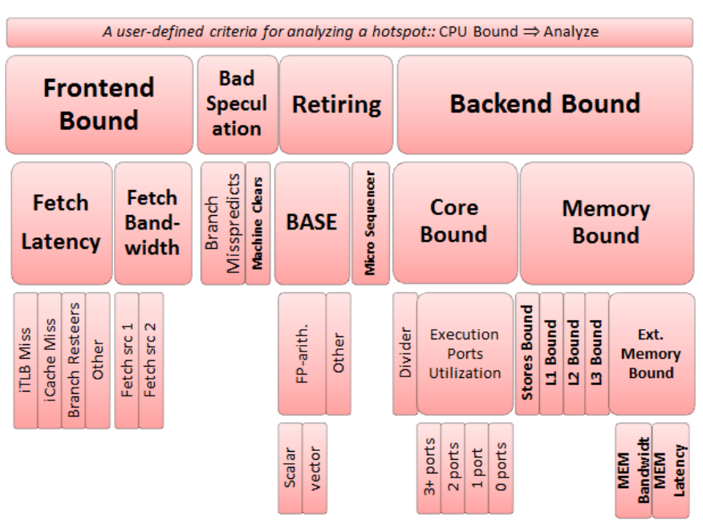

Cover some quick tools and some of my empirical approaches on profiling multi-core systems.
<!-- more -->

## `htop` - CPU utilizations, Hyper Threading, Cross Socket, and Memory Usage 

- CPU utilization of active cores should be close to 100%
- User space CPU utilization should be close to 100%
  - if not, pay attention to syscalls and faults (e.g. page faults)
- Normally no swap space should be used.


Note that `htop` only displays logical cores (identified by cpu_id) that might be hyper threads of physical cores. 
You can not tell which logical cores are on the same physical core from the `htop` panel.
`htop` does not show topology information such as [socket](https://en.wikipedia.org/wiki/CPU_socket) either.

In order to get the core topology, check `/proc/cpuinfo`.
An example:
``` bash
$ cat /proc/cpuinfo
```
```
processor       : 0
vendor_id       : GenuineIntel
cpu family      : 6
model           : 85
model name      : Intel(R) Xeon(R) Gold 6252 CPU @ 2.10GHz
stepping        : 7
microcode       : 0x500002c
cpu MHz         : 1057.852
cache size      : 36608 KB
physical id     : 0
siblings        : 48
core id         : 0
cpu cores       : 24
apicid          : 0
initial apicid  : 0
fpu             : yes
fpu_exception   : yes
cpuid level     : 22
wp              : yes
...

processor       : 1
vendor_id       : GenuineIntel
cpu family      : 6
model           : 85
model name      : Intel(R) Xeon(R) Gold 6252 CPU @ 2.10GHz
stepping        : 7
microcode       : 0x500002c
cpu MHz         : 999.633
cache size      : 36608 KB
physical id     : 1
siblings        : 48
core id         : 0
cpu cores       : 24
...
```

There are other alternative commands that shows more compact and readable cpu info.
For example:
``` bash
$ lscpu --all --extended
```
```
CPU NODE SOCKET CORE L1d:L1i:L2:L3 ONLINE    MAXMHZ    MINMHZ
  0    0      0    0 0:0:0:0          yes 3700.0000 1000.0000
  1    1      1    1 1:1:1:1          yes 3700.0000 1000.0000
  2    0      0    2 2:2:2:0          yes 3700.0000 1000.0000
  3    1      1    3 3:3:3:1          yes 3700.0000 1000.0000
  4    0      0    4 4:4:4:0          yes 3700.0000 1000.0000
  5    1      1    5 5:5:5:1          yes 3700.0000 1000.0000
  6    0      0    6 6:6:6:0          yes 3700.0000 1000.0000
  7    1      1    7 7:7:7:1          yes 3700.0000 1000.0000
  8    0      0    8 8:8:8:0          yes 3700.0000 1000.0000
  9    1      1    9 9:9:9:1          yes 3700.0000 1000.0000
 10    0      0   10 10:10:10:0       yes 3700.0000 1000.0000
 11    1      1   11 11:11:11:1       yes 3700.0000 1000.0000
 12    0      0   12 12:12:12:0       yes 3700.0000 1000.0000
 13    1      1   13 13:13:13:1       yes 3700.0000 1000.0000
 14    0      0   14 14:14:14:0       yes 3700.0000 1000.0000
 15    1      1   15 15:15:15:1       yes 3700.0000 1000.0000
 16    0      0   16 16:16:16:0       yes 3700.0000 1000.0000
 17    1      1   17 17:17:17:1       yes 3700.0000 1000.0000
 18    0      0   18 18:18:18:0       yes 3700.0000 1000.0000
 19    1      1   19 19:19:19:1       yes 3700.0000 1000.0000
 20    0      0   20 20:20:20:0       yes 3700.0000 1000.0000
 21    1      1   21 21:21:21:1       yes 3700.0000 1000.0000
 22    0      0   22 22:22:22:0       yes 3700.0000 1000.0000
 ...

```

## `/usr/bin/time` - Memory resident size, and  Context Switches.

Example of running `/usr/bin/time` on `ls`:
``` bash
$ /usr/bin/time -v ls
```
```
...
	Command being timed: "ls"
	User time (seconds): 0.00
	System time (seconds): 0.00
	Percent of CPU this job got: 100%
	Elapsed (wall clock) time (h:mm:ss or m:ss): 0:00.00
	Average shared text size (kbytes): 0
	Average unshared data size (kbytes): 0
	Average stack size (kbytes): 0
	Average total size (kbytes): 0
	Maximum resident set size (kbytes): 1960
	Average resident set size (kbytes): 0
	Major (requiring I/O) page faults: 0
	Minor (reclaiming a frame) page faults: 83
	Voluntary context switches: 1
	Involuntary context switches: 0
	Swaps: 0
	File system inputs: 0
	File system outputs: 0
	Socket messages sent: 0
	Socket messages received: 0
	Signals delivered: 0
	Page size (bytes): 4096
	Exit status: 0
```

## `perf` - CPU Cycles, Cache Misses, and more.

Check the [wiki](https://perf.wiki.kernel.org/index.php/Main_Page) for anything you need.

### `perf top`

`perf top` shows 'realtime' perf data and is interactive.
You can step in a function on the panel and visualize the hotspots in the assembly code (with C/C++ symbol annotations).

Symbols of an optimized binary may not be very intuitive, nevertheless it helps locate hotspots into several lines of code.

If the annotation symbols are lost, double check compiler options to ensure that the binary is compiled with `-g`. 
You can use `objdump -h a.out | tail` to verify that symbols (segments with header prefixed by 'debug_') are present in the binary. 

## Top Down analysis

Top down analysis is the recommended way to profile processes on cores that have Out-of-order and Speculative Execution.
My understanding Top-down analysis counts the events from the hardware perspective, for example its top-level breakdown tracks `uops` instead of branch mis-predictions and cache misses.

The hierarchical view:


A detailed design introduction is available on the paper [A Top-Down Method for Performance Analysis and Counters Architecture](https://ieeexplore.ieee.org/document/6844459).

Important DOs and DONTs:
>1. A value of an inner node should be disregarded unless nodes on the path from the root to that particular node are all flagged.
>2. Comparing fractions of non-sibling nodes is not recommended

Top down analysis can be applied through profilers such as VTune or more lightweight [pmu-tools](https://github.com/andikleen/pmu-tools).

``` bash
$ ~/pmu-tools/toplev.py --force-cpu=skx --core S0-C0 -l3 -v --no-desc
```

## Flame Graph

TODO: [FlameGraph](https://github.com/brendangregg/FlameGraph) 

## Off-CPU analysis

TODO: [bcc](https://github.com/iovisor/bcc)

## Memory Footprint

TODO: [https://github.com/stefannoll/mat](https://github.com/stefannoll/mat)

TODO: [Analyzing Memory Accesses With Modern Processors](https://dl.acm.org/doi/pdf/10.1145/3399666.3399896)

## Pahole (Poke a Hole)
Static analysis to show "holes" (unused bytes, unfilled cacheline) in your data structure due to alignment. 

TODO: [https://lwn.net/Articles/335942/](https://lwn.net/Articles/335942/)


## Reference:
- [https://unix.stackexchange.com/questions/57920/how-do-i-know-which-processors-are-physical-cores](https://unix.stackexchange.com/questions/57920/how-do-i-know-which-processors-are-physical-cores)
- [https://stackoverflow.com/questions/774556/peak-memory-usage-of-a-linux-unix-process](https://stackoverflow.com/questions/774556/peak-memory-usage-of-a-linux-unix-process)
