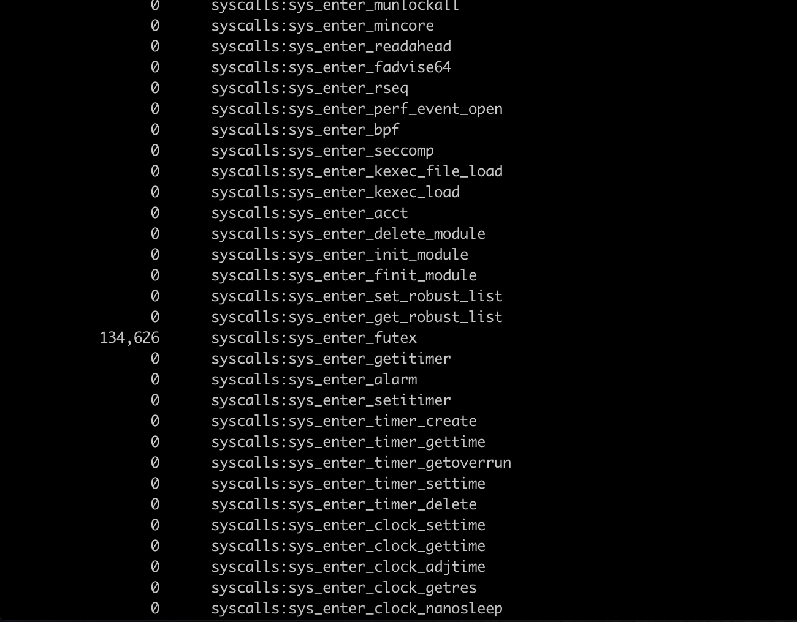
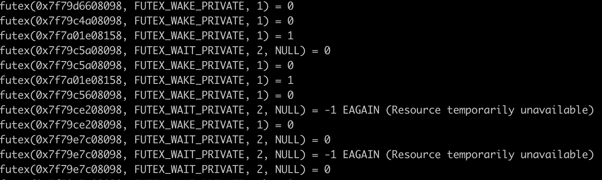
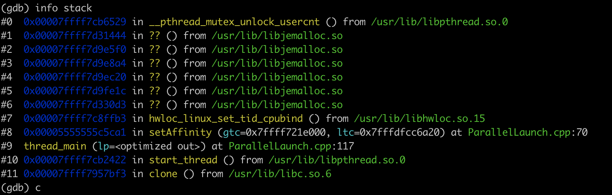

When running benchmarks in [Interval-Based-Reclamation](https://github.com/roghnin/Interval-Based-Reclamation), I observed a suspicious **Voluntary Context Switches** increase using epoch based reclamation. I profiled the program and traced the context switches back to some mutexes in [jemalloc](https://github.com/jemalloc/jemalloc).

<!-- more -->

## Stat process with `time`
I was trying to measure the memory usage peak of different memory reclamation approaches **NIL(no reclamation), HPBP(Hazard pointer based), and EBR(epoch based)**.
I used [`time`](https://man7.org/linux/man-pages/man1/time.1.html) to read system counters and get the memory consumption.

``` bash
LD_PRELOAD=/usr/lib/libjemalloc.so /usr/bin/time -v ./bin/main <args>
```

Note that [Interval-Based-Reclamation](https://github.com/roghnin/Interval-Based-Reclamation) does not use any memory pools or arenas, so it is required to use [jemalloc](https://github.com/jemalloc/jemalloc) to reduce page faults.


`/usr/bin/time` shows context switch information aside from memory's maximal resident size.
They are all recorded in the following table. 
|                   |ops/sec   |Memory Peak(KB)|Minor (reclaiming a frame) page faults|Voluntary context switches            |Involuntary context switches|
|-------------------|----------|---------------|--------------------------------------|--------------------------------------|----------------------------|
|NIL                |31,118,761|10,660,544     |238,047                               |2,997                                 |3,284                       |
|HPBR               |7,091,661 |554,064        |76,372                                |1,035                                 |3,186                       |
|EBR                |26,629,611|782,760        |243,314                               |<span style="color:red">211,896</span>|3,169                       |
**EBR** reclamation has far more voluntary context switches than no reclamation(100x) and **HPBR**(200x).


## Source of voluntary context switches

Voluntary context switches includes cases such as the process is waiting for an I/O operator to complete, the process triggers an fault, etc.

In running [Interval-Based-Reclamation](https://github.com/roghnin/Interval-Based-Reclamation), each thread is pinned 1:1 onto cpu cores wth no I/O operations.
Faults (e.g. page faults) are almost eliminated by using [jemalloc](https://github.com/jemalloc/jemalloc) as well.
Therefore, I suppose that these voluntary context switches are very likely coming from some syscalls.


## Count system calls with `perf`

In order to confirm the hypothesis that the **EBR** reclamation implementation somehow triggers a lot of syscalls, use `perf` to count all the system calls. 

``` bash
perf stat -e 'syscalls:sys_enter_*' -p $PID
```

Result shows that [`futex`](https://man7.org/linux/man-pages/man2/futex.2.html) has been continuously called.


## Trace system calls

`strace` can be used to show system calls as well.
``` bash
strace --trace=futex -p $PID
```

From the trace, `futex` is called from different PCs.


## Stacktrace the system call with `gdb`

To identify the PC of `futex`, use `gdb` to set a breakpoint on the `futex` syscall.

```
(gdb) catch syscall futex
```

One of the stack traces:



## Summary

The observed voluntary context switches are coming from mutexes inside jemalloc.
However, why and how it happens is still unknown, which may require a deeper understanding of the implementation of jemalloc and is out of the scope of this post.


## Reference
- [https://stackoverflow.com/questions/37743596/gdb-catch-syscall-condition-and-string-comparisson](https://stackoverflow.com/questions/37743596/gdb-catch-syscall-condition-and-string-comparisson)
