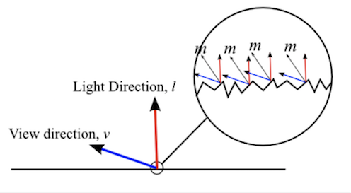
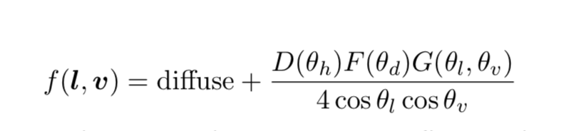
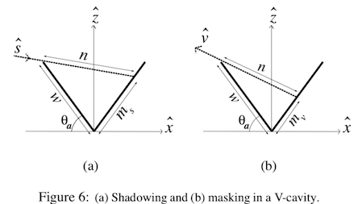

Physically based rendering is a recent hot area in game theindustry.
Most PBR implementation employs a ***microfacet model*** to parameterize the features of the material surface.
Here is a very shallow dive on microfacet.

<!-- more -->

## Microfacet model 
In the microfacet model, a surface consists of millions of micro surfaces, with each micro surface being perfectly smooth.
Each micro surface has a normal where only perfect reflection happens. 

Note that micro surface normals are somewhat related to the "macro" surface normal, but it's not the same.
An incident light to a rough surface will be scattered into different directions by every micro surface it can hit.

Normal of the micro surface is called `half-vector` and denoted by `h`.
Obviously, `h = normalize(l + v)` where `l` is the light direction and `v` is the view direction.

## Microfacet formula
A general form of microfacet model

has four terms **diffuse**, **distribution term (D)**, **fresnel term (F)** and **geometry term(G)**.
These four terms are always present for all the microfacet models, while the actual implementation of each term may differ by models.

## Distribution term
Distribution describes how many micro surfaces are hit in the light direction.

## Fresnel term
Fresnel term describes the physical phenomenon that for any lit surfaces, the amount of light reflected is related to the incident light angle.

In the above real world example, in the nearby area where the angle between view(light) direction and water surface normal is small, transmission (refraction) dominates.
However in the far area where the angle difference is larger, most of the light is reflected.

## Geometry term
Geometry term measures the amount of incident light and light reflected from micro surfaces that in the end is blocked by other micro surfaces.

See the above deep v-shaped micro surfaces, some incident light is blocked which causes part of the surface in shadow, and some reflected light is masked by the surface itself as well.

## Well-known microfacet models

- [Smith Geometrical shadow](https://ieeexplore.ieee.org/document/1138991/) an old and successful geometry shadow-mask model, adopted by a lot of recent PBR models.
- [Oren Nayar Diffuse](http://www1.cs.columbia.edu/CAVE/publications/pdfs/Oren_SIGGRAPH94.pdf) an improvement over the traditional Lambert diffuse model.
- [Schlick](https://onlinelibrary.wiley.com/doi/abs/10.1111/1467-8659.1330233) famous for its approximation on fresnel and geometry terms, well adopted model.
- [GGX](https://www.cs.cornell.edu/~srm/publications/EGSR07-btdf.html) extends microfacet BRDF to refraction and transmission. It introduces a new GGX distribution term together with a geometry term which is based on the Smith's model mentioned above. (Note a very good, self-contained paper)
- [Disney Principle](https://disney-animation.s3.amazonaws.com/library/s2012_pbs_disney_brdf_notes_v2.pdf) is a mix of GGX model and Schlick mode with its new diffuse term. It is adopted by Blender and seems to be the industrial standard.

## Reference
- [http://simonstechblog.blogspot.com/2011/12/microfacet-brdf.html](http://simonstechblog.blogspot.com/2011/12/microfacet-brdf.html)
- [https://disney-animation.s3.amazonaws.com/library/s2012_pbs_disney_brdf_notes_v2.pdf](https://disney-animation.s3.amazonaws.com/library/s2012_pbs_disney_brdf_notes_v2.pdf)
- [https://www.cs.cornell.edu/~srm/publications/EGSR07-btdf.html](https://www.cs.cornell.edu/~srm/publications/EGSR07-btdf.html)
- [http://www1.cs.columbia.edu/CAVE/publications/pdfs/Oren_SIGGRAPH94.pdf](http://www1.cs.columbia.edu/CAVE/publications/pdfs/Oren_SIGGRAPH94.pdf)
- [https://ieeexplore.ieee.org/document/1138991/](https://ieeexplore.ieee.org/document/1138991/)
- [https://onlinelibrary.wiley.com/doi/abs/10.1111/1467-8659.1330233](https://onlinelibrary.wiley.com/doi/abs/10.1111/1467-8659.1330233)
